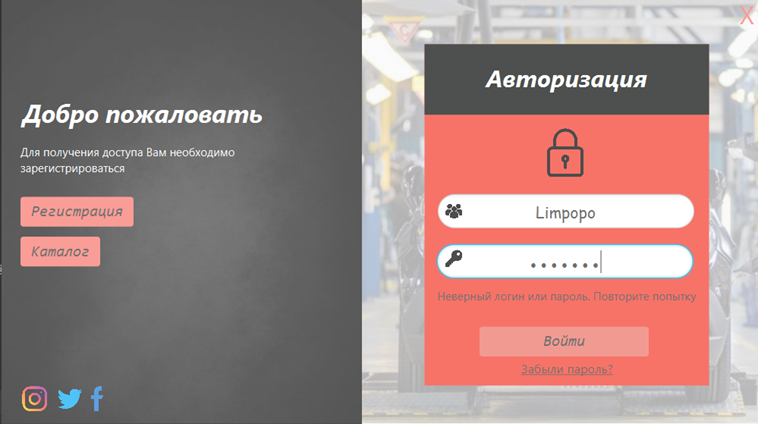
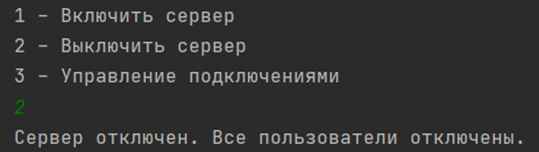

***Автоматизация на примере предприятия по производству автомобилей***
---
***
После запуска приложения отображается приветствие в виде окна.
Параллельно, в этот момент происходит подключение к серверу.

При нескольких неудачных попытка подключения к серверу,
пользователь получает соответствующее уведомление и возможность закрыть
окно.

Когда произошло успешное подключение к серверу, предыдущее окно
закрывается и открывается окно с авторизацией. Помимо авторизации,
пользователь без авторизации имеет доступ к просмотру автомобилей,
которые производятся на предприятии. Кроме того, на данном этапе
существует возможность регистрации и в случае, если забыли пароль,
восстановить его.

При ошибке авторизации, появляется уведомление о том, что данные
некорректны.
При нажатии на кнопку «Регистрация» сработает анимация кнопки и
откроется новое окно, с соответствующими полями для заполнения. При
отсутствии обязательных данных, появляется соответствующая подсказка.
После нажатия на кнопку «Зарегистрироваться» учетная запись будет
добавлена в БД. При возникновении ошибки, также будет отображено
сообщение.

При нажатии на кнопку «Каталог» пользователь получает доступ к
каталогу автомобилей, который производит данное предприятие.
Здесь он может ознакомится с характеристиками транспортного средства и
фильтровать по необходимому типу кузова.

При нажатии на кнопку «Забыли пароль» пользователь получает
возможность его восстановления c помощью указания почтового адреса,
который привязан к аккаунту.

На почту приходит сообщение с временным паролем.

***
###Вход в роли администратора

При входе в роле администратора появляется возможность просмотра
личных данных, а также их редактирования путем нажатия на
иконку «Карандаш». При вводе некорректных значений,
появляется соответствующее сообщение.

После нажатия на вкладку «Управление» администратор получает
возможность просмотра, редактирования путем двойного клика по
необходимой колонке, удаления и добавления данных в любую из таблиц в
БД. В разделе «Прочие» находятся таблицы «Тип топлива», «Тип кузова».
Кроме того, существует возможность сортировки данных по любому из
критериев. При вводе символов для поиска, осуществится поиск во всех
колонках. При совпадении останутся активными только найденные элементы 
Для удаления элемента необходимо выбрать строку из таблицы.

Для добавления в список нового автомобиля необходимо нажать на
кнопку «Добавить». На экране появится соответствующее меню, где
необходимо заполнить поля/выбрать вариант.

Во вкладке «Обращения» администратор получает список обращений
всех пользователей системы. Для ответа необходимо ввести
идентификационный номер вопроса. При корректном вводе, открывается
окно, где необходимо написать ответ. При отправке пустого
поля, появляется соответствующая подсказка. Также, при ошибке записи
появляется сообщение.

При выборе вкладки «Статистика», администратор получает доступ к
статистике запусков программного средства за последние 7 дней. После нажатия на кнопки «Отчет», программа сгенерирует лог-файл с
названием «reportActivityLog», который будет хранится в папке «reports».
Также становится доступной кнопка «Открыть». При нажатии на нее
открывается отчет в .txt формате.

Для того, чтобы авторизоваться под другим пользователем, необходимо
выбрать пункт меню «Выйти».

###Вход в роли инженера
Как и в роли администратора, инженеру доступен просмотр профиля,
каталога. При нажатии на вкладку «Обратная связь» отобразится история
обращений и состояние ответа.

При переходе во вкладку «Обратная связь», инженер может отправить
обращение при заполнении текстового поля. При попытке отправки пустого
обращения выводится сообщение о минимальном количестве символов .

При выборе пункта меню «Статистика выпуска» пользователь получает
информацию о количестве произведенных автомобилей на предприятии в виде
диаграммы. Снизу располагается легенда.

***
###Вход в роли бухгалтера

При переходе во вкладку «Управление» пользователь получает
возможность управлять персоналом. Во вкладке «Прочее» находятся данные
о должностях, их нагрузке, тарифу 1-го разряда и зарплате.
Удалить пользовательский аккаунт может только администратор. Бухгалтер
может только уволить работника, редактировать его данные или добавить
нового. Для пролистывания данных, внизу добавлена скролл-панель.

Сортировка данных доступна как по возрастанию, так и по убыванию по
любому из доступных критериев путем нажатия на название поля.

Для добавления нового сотрудника в систему, необходимо нажать на
кнопку добавить.

После заполнения полей, необходимо подтвердить добавление. При возникновении
ошибок, будет выведено соответствующее сообщение.
Отображен поиск наилучшей альтернативны на основе
принципа Кондорсе. В системе существует четыре эксперта, которые
осуществили ранжирование альтернатив. Их данные занесены в программу.

Путем нажатия на кнопку «Создать отчет». Результат операции будет выведен
на экран.

При выборе пункта меню «Рассылка сообщений» бухгалтер имеет
возможность отправить письмо на почту работника, привязанную к аккаунту.
На почту сотрудника приходит письмо с сообщением, которое отправил
бухгалтер.

***
###Серверная сторона

При запуске сервера, появляется меню.

Как только сервер будет включен, пользователи смогут подключаться к
нему. При завершении работы программы со стороны клиента, происходит
отображение в консоль об отключении. Для завершения подключения новых пользователей необходимо
выбрать пункт «Выключить сервер».

